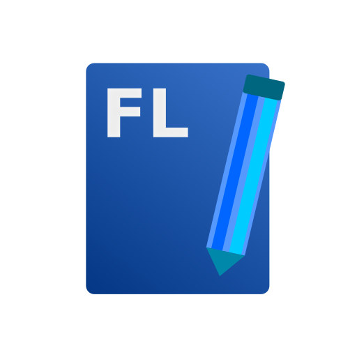
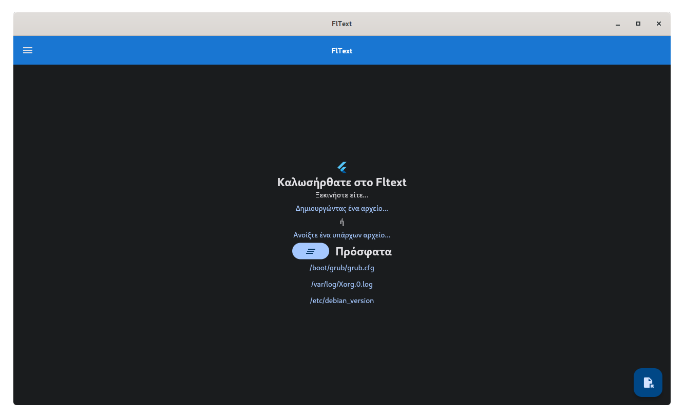
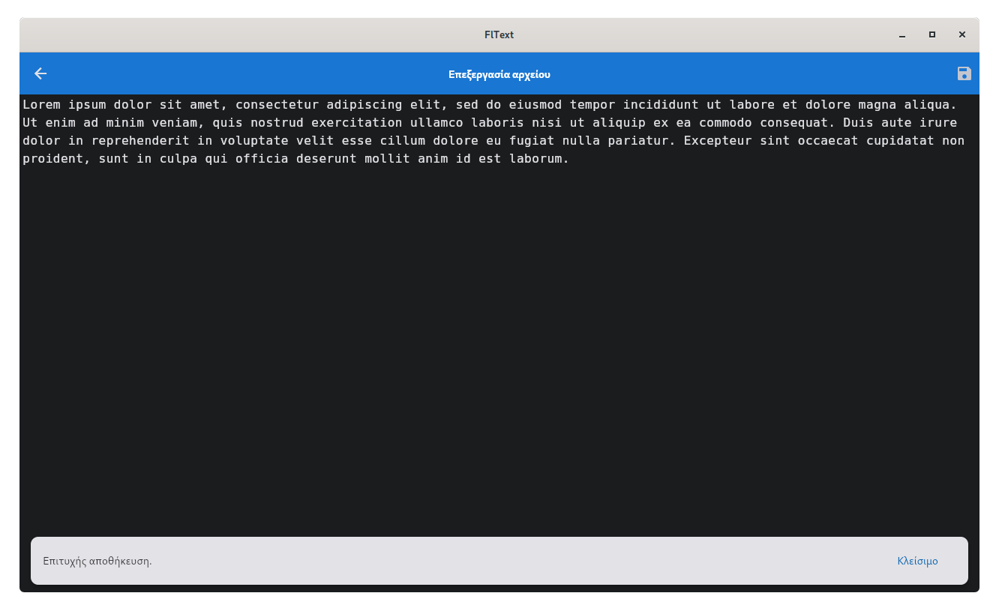

    <h1>FlText</h1>
    
     
    
    
    

A text edittor written using [Dart/Flutter](https://flutter.dev). I wrote it so I can exercise my Flutter skills with something I could actually use in my everyday life. It supports almost all languages and scripts in its encoding, has only a handful of dependencies, looks beautiful and runs on just about anything: **Windows, macOS, Linux, Android, iOS and the [Web\*](https://tseli0s.github.io/fltext.web).**

<h6>
    <i>
        Actually, it doesn't run very well on the web (You can't open or save a file, just use it as a temporary notepad). But there will be patches in the future to make it work as much as possible. Thanks for your understanding :)
    </i>
</h6>

The text editor is localized in the following languages: 🏴󠁧󠁢󠁥󠁮󠁧󠁿🇬🇷🇷🇺🇪🇸. You can also help translate this application, so if you speak another language, feel free to drop a PR!

# Installation
To build from source (The only reliable way so far), you must install **Flutter** and build from the command line for the platform you are targeting accordingly. Prebuilt packages aren't yet available, but they will be once the application is ready to be used.

Android and Linux packages will be provided at the [Releases page](https://github.com/tseli0s/FlText/releases). For other platforms, no direct package will be provided; You are free to build one and distribute it freely, assuming you comply with the [license](./LICENSE).

You can also (sort-of) try it online without installing anything. Head to the [web version](https://tseli0s.github.io/fltext.web) to run a sample version.

# Screenshots

